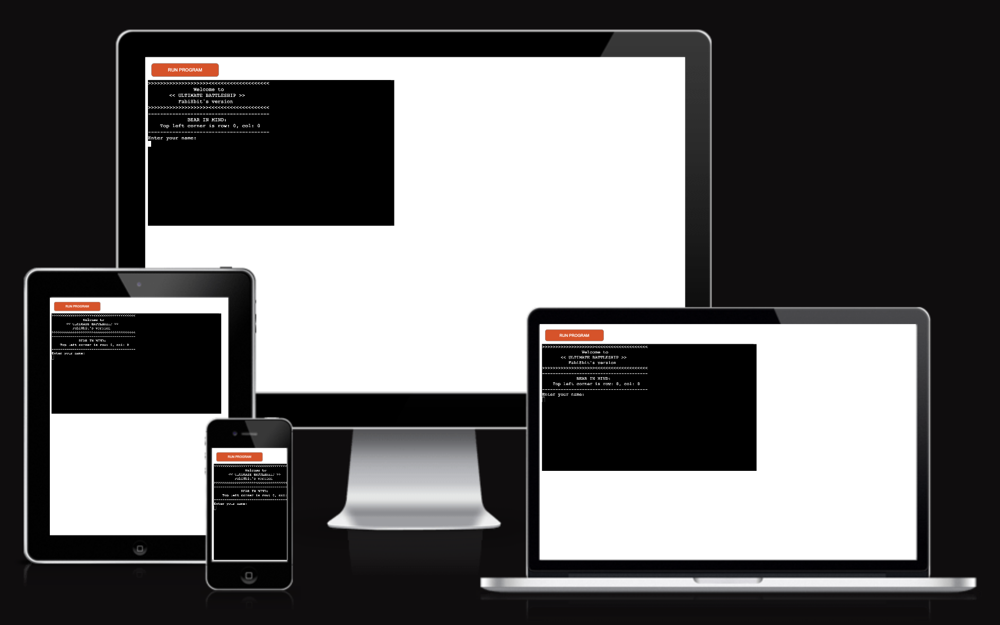
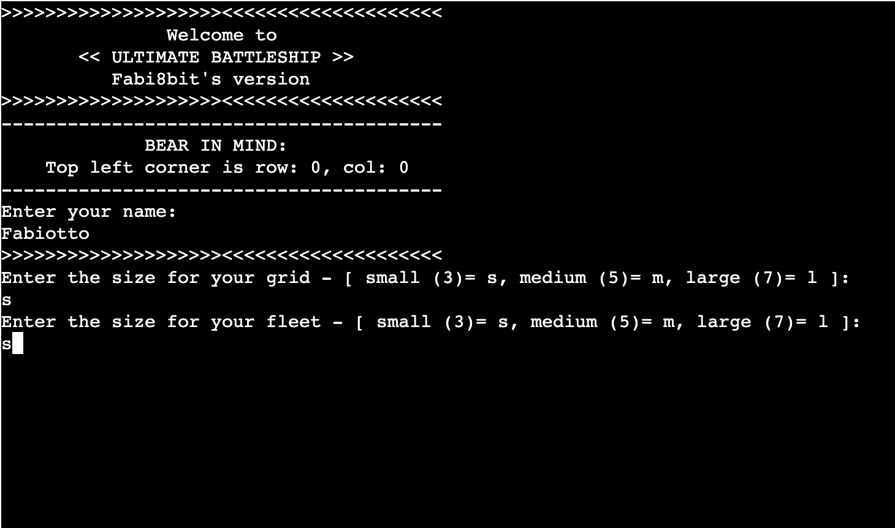
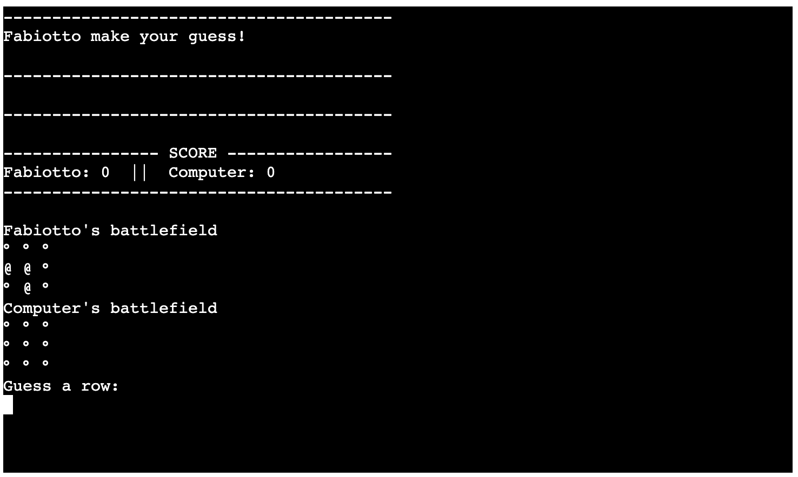
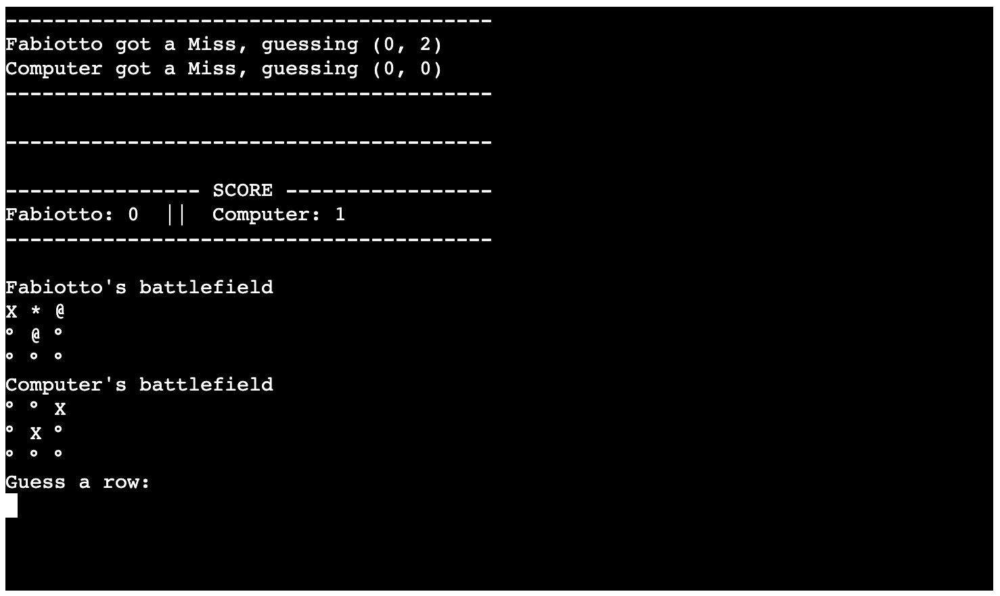
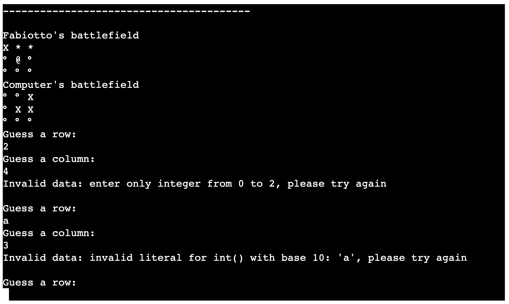

# Ultimate Battleship Fabi8bit's version

Ultimate Battleship Fabi8bit's version is a terminal game developed in Python and based on the Code Institute Portfolio Project number 3 called Ultimate Battleship.
The game runs on the Code Institute mock terminal on the Heroku platform. Here is the direct link to play the [game](https://ultimate-battleship-fabi8s-ver.herokuapp.com/) on the mock terminal: [Ultimate Battleship Fabi8bit's version](https://ultimate-battleship-fabi8s-ver.herokuapp.com/)
The original game is a two-player strategy game, and the objective is to sink all of the opponent ships before the opponent sinks yours. It's typically played on a square grid of varying dimensions, where the player can place the ships.
In this simplified version of the game, the user and the computer are the two players, and ships occupy only one space on the grid. The placement of the ships is also automated and it happens in a totally random way for both the player and the computer.

## How to play

At the launch of the program, the user will find a welcome page, where they will be able to enter the player name, choose the size of the battlefield grid, and the size of the fleet.
The grid is composed by a sequence of "°" symbols, and the user's ships are indicated by an "@" symbol. Of course the computer board is presented as an empty grid. A missed shot will be marked on the board with the "X" symbol on the corresponding coordinate, while a hit will be displayed as' * 'symbol.
The user will input the coordinates for their shots, while the coordinates for the computer are generated randomly.
The winner is the one who sinks the opponent ships first.

## Existing features
### Game set-up

- __Custom name for the user__

  - The name of the user will be used throughout the game to display the score.

- __Size of the battleship grid__

  - The user can choose among three sizes for the grid: small (3x3), medium (5x5), large (7x7). To facilitate the input for the size, one must enter the letter s for small, m for medium, or l for large.

- __Size of the fleet__

  - The user can choose among three sizes for their fleet: small (3 ships), medium (5 ships), large (7 ships). To facilitate the input for the size of the fleet, one must enter the letter s for small, m for medium, or l for large.
  

### Consistent interface
At the launch of the program the screen is cleared. The guesses, the scores, and the battlefield grids are displayed in the same position throughout the game, so the user can find all the needed information in the same spot.

- __Random ships placement__

 - A function that generates random coordinates will position the ships (the computer's fleet is hidden to the user's view)

- __User input for guesses__

 - The users can choose the coordinates for their guesses
 - The computer guesses are randomly generated
 

- __Input validation__

 - The entered coordinates pass through a validation function that checks whether the entered data is correct. The game won't proceed until the input is correct.
 - Fleet and battlefield sizes have to be a letter among s, m, or l
 - Coordinates have to be numbers
 - The same guess cannot be entered more than once
 
 

### Features to be implemented in the future

 - __User against user__
 - __Custom ship placement__
 - __Graphic Interface__
 

## Data model and data flow
 For the data model I was entirely inspired by the one used in the Ultimate Battleship example presented during the course. I changed the names of the classes and functions, and figured out what would be the best way for data flow.
 I tried to keep all the functions "atomic" as suggested during the course.
 The data flow goes as follows:
 - The screen will be cleared and a welcome message as well as a hint are displayed.
 - The User will be asked to type the name, and this value will be assigned as the name for the player when the Battllefield class is instantiated.
 - The User will be asked to insert the desired size for the battlefield grid and fleet. This value will be passed for the instance creation.
 - The computer and the player instances will be created: The Battlefield class stores grid size, fleet size, name, type (this value will be used for if statements inside the functions), opponent guesses, ships coordinates. The class also has methods like the grid print, random coordinates generator, ships coordinates list creator, opponent guess list creator.
 - The random ship placement method will be invoked at this point for both players and passed through a validation function to ensure that the coordinates are unique and within battlefield grid size. The right coordinates returned by the function are added to the relative player's coordinates list in the instantiated Class.
 - The battlefield grid will be printed in the console. The ships are displayed only in the player's grid.
 - The user is prompted to the guess part. The input for Row and Column is asked sequentially, and verified.
 - The consolle will be cleared again at this point, and the scoreboard and the updated grid will be printed to the consolle in the same spot, giving the impression that the interface is updating live. The Hit and Miss shots are reppresented with an " * " or "X" respectively, on both grids.
 - The guesses list is updated on both instances of Class Battlefield
 - The loop keeps going until one of the two scores reaches the size of the fleet, which means there are no more ships to sink. The loop will break.
 - The winner function is invoked. After a simple score check, the winner's name will be returned by this function.
 - The winner's name will be printed to the consolle, and the program will close.

## Testing
 - The code was passed through the Code Institute PEP8 linter without any issues.
 - Invalid inputs are rejected by the evaluation data processes.
 - The program works without any issues on the local terminal as well on the Heroku mock terminal.

## Deployment steps
 - Clone or fork this repository
 - Create a new Heroku app
 - Under app settings configure the variables: KEY: PORT, VALUE: 8000
 - Add the buildpacks in this order: Python, Node JS
 - Link the Heroku app to this repository under the Deploy tab
 - Under the Manual deploy section select the main branch and click on Deploy Branch
 - When building is complete, click on View to open the mock terminal

## Credits
 -  this code: " not in ("s", "m", "l") " under the validate_data function
is a tip taken from this post https://stackoverflow.com/questions/22304500/multiple-or-condition-in-python

- this code: " if not (all([isinstance(item, int) for item in t])) " under validate_coord function, is a tip taken from this post https://datascienceparichay.com/article/python-check-tuple-contains-only-numbers/

- this code: " winner_check = max(scores, key=scores.get) " under winner function, is a tip taken from this post https://datagy.io/python-get-dictionary-key-with-max-value/
